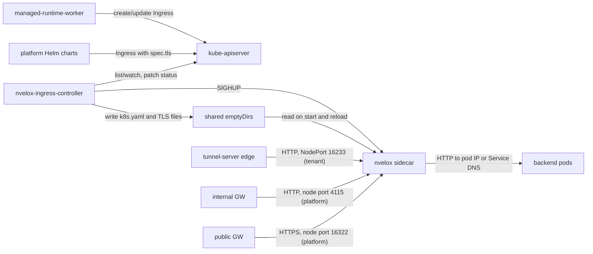
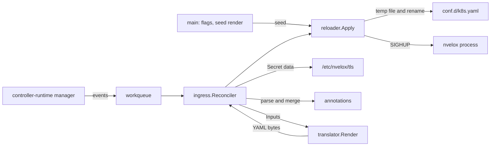
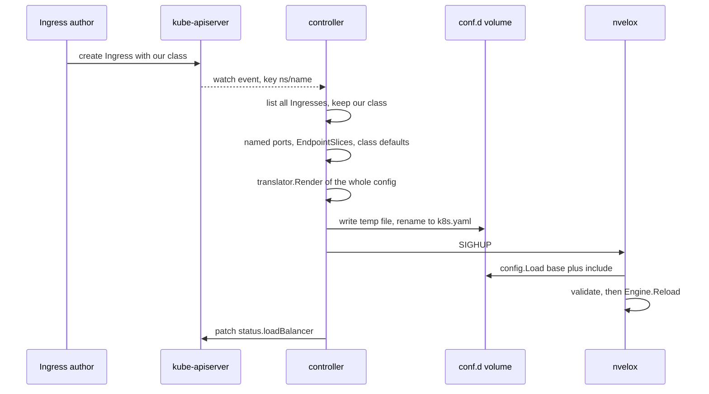
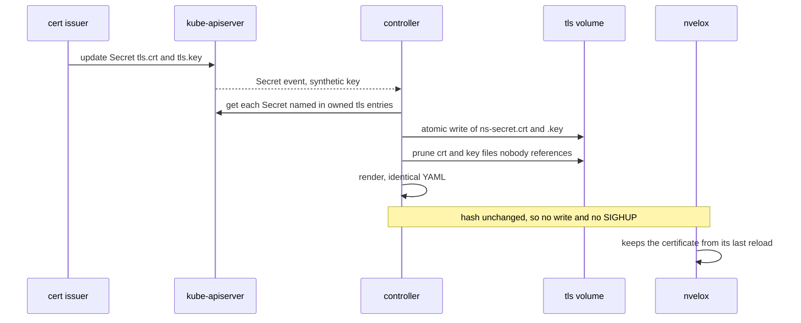
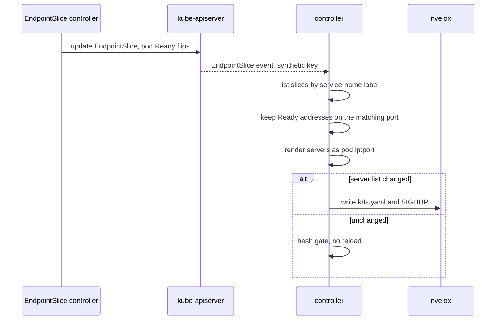
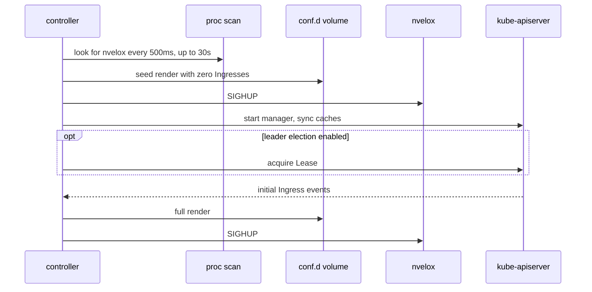

# nvelox-ingress-controller architecture

nvelox-ingress-controller is a Kubernetes Ingress controller that runs in the same pod as an nvelox proxy. It watches the Ingresses of its IngressClass, renders all of them into one nvelox YAML fragment on a shared volume, and sends nvelox a SIGHUP so it hot-reloads (`internal/ingress/reconciler.go:72-166`, `internal/reloader/reloader.go:54-110`). ngris runs it twice. The platform install (class `nvelox`) serves the platform charts' Ingresses behind the internal and public gateways. The tenant install (class `nvelox-tenant`) is what the edge tunnel-server dials to reach managed apps in the tenant cluster.

## At a glance

| | |
|---|---|
| Role | Ingress controller: Ingress objects in, an nvelox config file and a SIGHUP out |
| Language / runtime | Go 1.25, controller-runtime v0.19.3, client-go v0.31 (`go.mod:3-11`); static binary on alpine 3.20 (`Dockerfile:7-22`) |
| Entrypoint | `main()` (`main.go:72`); image entrypoint `/usr/local/bin/nvelox-ingress-controller` (`Dockerfile:22`) |
| Ports | Controller: `:8082` metrics, `:8083` healthz/readyz (`main.go:113-116`). nvelox sidecar: `:8080` HTTP, `:8443` HTTPS, `:9090` metrics (`deploy/helm/nvelox-ingress-controller/values.yaml:91-103`). The Service maps 80 and 443 onto them (`deploy/helm/nvelox-ingress-controller/templates/service.yaml:36-47`) |
| How it runs | One Deployment, one pod with two containers (`controller`, `nvelox`) and `shareProcessNamespace: true`, 1 replica by default (`deploy/helm/nvelox-ingress-controller/templates/deployment.yaml:47`, `deploy/helm/nvelox-ingress-controller/values.yaml:63`) |
| ngris installs | Platform: class `nvelox`, reached on node ports 4115 (HTTP) and 16322 (HTTPS) of nodes 10.0.0.101-103. Tenant: Ansible-rendered manifests, class `nvelox-tenant`, NodePort 16233, HTTP only |
| State | No database. The rendered config and TLS files live on pod emptyDirs; the last config hash is in memory |
| Main dependencies | kube-apiserver (watches and status patches), the nvelox process in the same pod (files and SIGHUP) |

## Context

- **kube-apiserver.** The manager watches Ingress, Service and EndpointSlice, plus Secret only with `--watch-tls-secrets` (`main.go:205-219`). IngressClass, ConfigMap and Node are read on demand (`internal/ingress/reconciler.go:182`, `internal/ingress/reconciler.go:201`, `internal/ingress/reconciler.go:401`). The controller writes only `status.loadBalancer` on owned Ingresses (`internal/ingress/reconciler.go:360-362`).
- **nvelox sidecar.** The base config includes `/etc/nvelox/conf.d/*.yaml` (`deploy/helm/nvelox-ingress-controller/values.yaml:95-105`), and the controller writes `conf.d/k8s.yaml` (`main.go:93`). On SIGHUP nvelox reloads the whole config and, if validation fails, keeps what it had (`nvelox/main.go:93-102`).
- **managed-runtime-worker.** It creates one Ingress per tenant app: class `nvelox-tenant`, host `app-<app>.<account>.<suffix>`, path `/` (Prefix), the app Service on the app port, and no `tls` (`managed-runtime-worker/worker/ingress.go:76-115`). The default suffix is `apps.tenant.internal` (`managed-runtime-worker/config/config.go:479-480`).
- **Platform charts.** Example: the api-server Ingress uses class `nvelox`, `nvelox.io/*` annotations and a TLS Secret (`deploy/helm/api-server/values.yaml:59-74`).
- **tunnel-server.** It dials the tenant NodePort (`deploy/helm/tunnel-server/values-eu-fin.yaml:105`). The tenant host firewall only lets tunnel-server sources reach 16233 (`tf-infra/ansible/inventory/prod/group_vars/k8s_tenant/firewall.yml:27-35`).
- **Gateways.** The internal GW's backends point at node port 4115 (`tf-infra/ansible/inventory/prod/group_vars/internal-gw/backends.yaml:150-155`). The public GW's point at 16322, with backend TLS that does not verify the certificate (`tf-infra/ansible/inventory/prod/group_vars/public-gw/backends.yaml:9-17`).
- **Backends.** nvelox connects to the Ready pod IPs from EndpointSlices, or to the Service DNS name when there are none (`internal/translator/translator.go:379-389`).

## Inside

| Package | Responsibility | Key files |
|---|---|---|
| `main` | Flags and env, JSON logging, waiting for nvelox, seed render, the manager with its watches, probes | `main.go:72-243` |
| `internal/ingress` | Reconcile: filter by class, sync TLS files, resolve named ports and EndpointSlices, load class defaults, render, apply, publish status | `internal/ingress/reconciler.go:72-166` |
| `internal/translator` | Pure function from Ingresses to nvelox YAML: no client, no I/O | `internal/translator/translator.go:235-571` |
| `internal/annotations` | Parse `nvelox.io/*` keys into a typed Spec, merge class defaults | `internal/annotations/annotations.go:131-258` |
| `internal/reloader` | Hash gate, atomic write, PID discovery, SIGHUP | `internal/reloader/reloader.go:54-200` |

**The render.**
- **HTTP listener.** One shared listener, `k8s-http`, on `:<http-port>`. It holds every route whose host has no TLS entry, then the redirect routes, then the catch-all 404 static route last (`internal/translator/translator.go:479`, `internal/translator/translator.go:468-477`, `internal/translator/translator.go:496-525`).
- **HTTPS listeners.** One per (host, Secret) pair, on `:<https-port>`, with `server_names: [host]` and cert/key paths `<tls-cert-dir>/<ns>-<secret>.crt|.key` (`internal/translator/translator.go:437-456`). A host listed in `tls[]` gets no plain HTTP route, only the optional redirect.
- **Backends.** One per (namespace, Service, port), named `k8s-<ns>-<svc>-<port>` (`internal/translator/translator.go:366-392`, `internal/translator/translator.go:670-672`).
- **Route order.** Ingresses are sorted by namespace/name and routes keep spec order (`internal/translator/translator.go:248-255`). nvelox uses the first route that matches, comparing hosts exactly (`nvelox/core/httpproxy/router.go:38`, `nvelox/core/httpproxy/router.go:92-110`). Paths are not sorted by length, so a `/` listed before `/api` hides `/api`. A rule with no host in an Ingress that sorts earlier hides every later host on the same listener.
- **Not translated:**
  - `spec.defaultBackend`, which the translator never reads (it walks only `tls` and `rules`, `internal/translator/translator.go:310-354`);
  - resource backends (`internal/translator/translator.go:360-365`);
  - `Exact` path type, which becomes a prefix match (`internal/translator/translator.go:653-668`);
  - named ports that cannot be resolved (`internal/translator/translator.go:366-369`).

## Key flows

### 1. An Ingress becomes a live route

- **Whole-config rebuild.** Every reconcile rebuilds the full config from the informer cache; the key that triggered it is only used in logs (`internal/ingress/reconciler.go:72-90`). An Ingress is ours only if `spec.ingressClassName` equals `--ingress-class`. The IngressClass `controller` field is not checked (`internal/ingress/reconciler.go:437-446`).
- **Write path.** The reloader hashes the rendered bytes; if nothing changed, it skips both the write and the SIGHUP (`internal/reloader/reloader.go:58-61`). Otherwise it writes a temp file, fsyncs it, renames it in the same directory (`internal/reloader/reloader.go:66-93`), finds the PID and signals (`internal/reloader/reloader.go:95-105`).
- **No feedback from nvelox.** A delivered SIGHUP counts as success and the hash is recorded (`internal/reloader/reloader.go:103-109`). The controller never learns whether nvelox accepted the config. A rejected file is visible only in nvelox's log, "Config reload failed (validation)" (`nvelox/main.go:95-98`).
- **Status.** This step runs only when `--publish-service` is set. For a LoadBalancer Service the controller publishes its ingress IPs or hostnames. For a NodePort Service it publishes one InternalIP per Node. A ClusterIP Service publishes nothing (`internal/ingress/reconciler.go:382-415`). It patches only Ingresses whose status differs (`internal/ingress/reconciler.go:355-367`). Errors are logged and not retried (`internal/ingress/reconciler.go:161-165`).

### 2. A TLS Secret is rotated (only with `--watch-tls-secrets`)

- **Flag gate.** The Secret watch is registered only when `--watch-tls-secrets` (or env `WATCH_TLS_SECRETS=true`) is set (`main.go:121-126`, `main.go:212-219`). With the flag off, `syncTLSSecrets` returns at once and logs a warning if any owned Ingress has `tls[]` (`internal/ingress/reconciler.go:458-470`).
- **Files.** The key file is mode 0640 and the cert 0644; both are written as temp file plus rename (`internal/ingress/reconciler.go:615-669`). A Secret that does not exist yet is skipped but stays in the keep-set, so its old files survive (`internal/ingress/reconciler.go:491-511`). Unreferenced `*.crt` and `*.key` files are pruned after the writes (`internal/ingress/reconciler.go:528-563`).
- **Rotation does not reload nvelox.** The YAML holds only file paths (`internal/translator/translator.go:446-452`), and the reloader hashes only the YAML. A rotated Secret therefore renders identically and sends no SIGHUP. nvelox re-reads certificates only during a reload (`nvelox/core/engine.go:407-415`). The new certificate goes live on the next unrelated config change, or when the pod restarts.
- **New Secret, same problem.** When a new Ingress names a Secret that does not exist yet, the render already points at the missing files. nvelox rejects that reload with "TLS cert file not found" (`nvelox/config/config.go:680-685`). When the Secret arrives, the render does not change, so no reload follows. Until the file exists, every reload of that nvelox fails validation, which holds back route changes for every Ingress it serves.

### 3. A backend endpoint changes

- **Event fan-in.** Service and EndpointSlice events from any namespace all enqueue the same empty key (`main.go:206-211`, `main.go:248-250`), so a burst collapses into one pending item. No concurrency option is set (`main.go:168-174`), so reconciles run one at a time (the controller-runtime default).
- **Which endpoints count.** Only Services that owned Ingresses reference are looked up (`internal/ingress/reconciler.go:252-283`). Endpoints marked `ready=false` are skipped; an unset `ready` counts as ready (`internal/ingress/reconciler.go:316-321`).
- **Port matching.** The slice port is compared with the Service port named in the Ingress (`internal/ingress/reconciler.go:303-313`). EndpointSlice ports hold the endpoint (pod) port, so when a Service's `port` differs from its `targetPort` nothing matches. Such a backend silently falls back to the Service DNS name and kube-proxy (`internal/translator/translator.go:379-389`). Tenant app Services use `port == targetPort` (`managed-runtime-worker/worker/reconcile.go:996-1000`), so they get per-pod addresses.
- **Server order.** Server lists are not sorted. A Service with more than one EndpointSlice can come back in a different order from the cache, which changes the hash and causes a reload (`internal/ingress/reconciler.go:300-330`).

### 4. Controller start and restart

- **Waiting for nvelox.** `WaitForNvelox` polls every 500 ms for `--nvelox-wait` (30 s). A timeout only produces a warning (`main.go:155-157`, `internal/reloader/reloader.go:189-199`).
- **Finding the PID.** The lookup tries `--pid-file` first, then scans `/proc/*/comm` for `--proc-name`, skipping PID 1 and itself (`internal/reloader/reloader.go:115-129`, `internal/reloader/reloader.go:159-183`). nvelox has a `server.pid_file` field but nothing writes it (`nvelox/config/config.go:79` is the only reference), so in practice the `/proc` scan finds the process. The scan needs `shareProcessNamespace` (`deploy/helm/nvelox-ingress-controller/templates/deployment.yaml:47`). The signal needs a shared UID: the pod-level `runAsUser: 1000` covers both containers (`deploy/helm/nvelox-ingress-controller/values.yaml:142-145`).
- **Seed render.** It runs before the manager and always overwrites `k8s.yaml` with the empty-cluster render: just the catch-all 404 listener, when a default-backend root is set (`main.go:50-62`, `main.go:164-166`). On a fresh pod this binds the HTTP port early. If only the controller container restarts, nvelox loses all its routes and answers 404 until the first reconcile after cache sync. With leader election on, that lasts until this replica holds the Lease.
- **Hash reset.** `lastHash` lives only in memory (`internal/reloader/reloader.go:45-47`), so the first reconcile after any restart always writes and signals.
- **Leader election does not give HA.** With `--leader-elect`, only the leader runs the reconciler (controller-runtime runs controllers on the leader only). Every replica has its own nvelox, so the non-leader pods keep the seed config and return 404 for every host, while staying Ready behind the Service. The chart nonetheless suggests leader election plus 2+ replicas for HA (`deploy/helm/nvelox-ingress-controller/values.yaml:63-68`).

## Data and state

| Kubernetes object | Access | Purpose |
|---|---|---|
| Ingress (all namespaces) | watch; status patch on owned ones | Primary input, status output (`main.go:206`, `internal/ingress/reconciler.go:343-369`) |
| Service | watch, get | Named-port map, publish-service address (`internal/ingress/reconciler.go:571-612`, `internal/ingress/reconciler.go:387-390`) |
| EndpointSlice | watch, list by label | Per-pod servers (`main.go:211`, `internal/ingress/reconciler.go:290-296`) |
| Secret | watch and get, only with the flag | TLS files (`main.go:212-219`, `internal/ingress/reconciler.go:498-503`) |
| IngressClass, ConfigMap | get, not watched | Class-level defaults (`internal/ingress/reconciler.go:180-215`) |
| Node | list, not watched | NodePort status addresses (`internal/ingress/reconciler.go:399-410`) |
| Lease | only with `--leader-elect` | Leader election (`main.go:172-173`) |

| Path in pod | Written by | Read by |
|---|---|---|
| `/etc/nvelox/nvelox.yaml` | ConfigMap (base config) | nvelox (`deploy/helm/nvelox-ingress-controller/templates/configmap.yaml:7-16`) |
| `/etc/nvelox/conf.d/k8s.yaml` (emptyDir) | controller | nvelox via `include` |
| `/etc/nvelox/tls/<ns>-<secret>.crt` and `.key` (emptyDir) | controller | nvelox, read-only mount (`deploy/helm/nvelox-ingress-controller/templates/deployment.yaml:132`) |
| `/var/run/nvelox` (emptyDir) | intended for nvelox's PID file, not written today | controller |
| `/etc/nvelox/default-www` (empty emptyDir) | nobody | nvelox, as the root of the catch-all 404 |

All volumes are emptyDirs (`deploy/helm/nvelox-ingress-controller/templates/deployment.yaml:137-150`), so a new pod rebuilds everything from the API. In memory the controller keeps the informer caches, the last config hash, and a set of already-logged invalid annotation values that is never pruned (`internal/annotations/annotations.go:352-383`). It uses no database, Redis or queue.

## Configuration

Flags fall back to the env var shown when there is one (`main.go:91-126`).

| Flag | Env | Default | Meaning |
|---|---|---|---|
| `--ingress-class` | `INGRESS_CLASS` | `nvelox` | `spec.ingressClassName` we own |
| `--config-path` | `CONFIG_PATH` | `/etc/nvelox/conf.d/k8s.yaml` | Rendered file; must be in nvelox's `include` |
| `--pid-file`, `--proc-name` | `PID_FILE`, `PROC_NAME` | `/var/run/nvelox/nvelox.pid`, `nvelox` | SIGHUP target lookup |
| `--tls-cert-dir` | `TLS_CERT_DIR` | `/etc/nvelox/tls` | Where Secret material is written |
| `--default-backend-root` | `DEFAULT_BACKEND_ROOT` | `/etc/nvelox/default-www` | Root for the catch-all 404. Only the flag can set it empty, because an empty env value counts as unset (`main.go:252-257`) |
| `--trusted-proxies` | `TRUSTED_PROXIES` | empty | CSV emitted as `trusted_proxies` on every listener (`internal/translator/translator.go:523`, `internal/translator/translator.go:542`) |
| `--publish-service` | `PUBLISH_SERVICE` | empty | `<ns>/<name>` whose address goes into Ingress status; empty disables status |
| `--http-port`, `--https-port` | `HTTP_PORT`, `HTTPS_PORT` | 8080, 8443 | In-pod listener ports |
| `--watch-tls-secrets` | `WATCH_TLS_SECRETS` (`true`) | false | Watch Secrets and write TLS files |
| `--nvelox-wait` | none | 30s | Boot wait for the nvelox process |
| `--metrics-bind-address`, `--health-probe-bind-address` | none | `:8082`, `:8083` | Manager endpoints |
| `--leader-elect`, `--leader-elect-id` | none | false, `nvelox-ingress-controller` | Lease-based leader election |

The chart passes `--watch-tls-secrets` neither as a flag nor as an env var (`deploy/helm/nvelox-ingress-controller/templates/deployment.yaml:66-88`).

**Annotations.** "Listener" scope means either the shared `k8s-http` listener, which every non-TLS host on this controller shares, or the HTTPS listener of a single (host, Secret) pair.

| Annotation | Value | Scope | Effect |
|---|---|---|---|
| `nvelox.io/redirect-https` | bool | Ingress, TLS hosts only | 301 to `https://${host}${uri}` on the HTTP listener (`internal/translator/translator.go:468-477`) |
| `nvelox.io/rate-limit-per-second` | positive int | listener | `ip_rate_limit`; when several Ingresses set it, the strictest wins (`internal/translator/translator.go:291-306`, `internal/translator/translator.go:609-636`) |
| `nvelox.io/rate-limit-per-minute` | positive int | listener | Converted to ceil(n/60) rps with burst n |
| `nvelox.io/sticky-cookie` | cookie name | backend | Cookie session affinity, TTL fixed at 1h; the first Ingress in sort order wins (`internal/translator/translator.go:396-399`, `internal/translator/translator.go:554-563`) |
| `nvelox.io/allow-cidrs`, `nvelox.io/deny-cidrs` | CSV of CIDRs | listener | Union of all contributors into `ip_allowlist` / `ip_denylist`; invalid CIDRs dropped (`internal/annotations/annotations.go:301-322`) |
| `nvelox.io/strip-prefix` | path starting with `/` | this Ingress's routes | Switches to `path_regex` plus `rewrite`, only where the path starts with the prefix (`internal/translator/translator.go:413-428`) |
| `nvelox.io/request-headers`, `nvelox.io/response-headers` | `Name: Value` per line | this Ingress's routes | `headers.request_add` / `response_add` (`internal/translator/translator.go:430-435`) |

- **Shared limits.** A rate limit or allowlist on one plain-HTTP Ingress applies to every plain-HTTP Ingress on that controller. Platform charts set high limits for this reason (`deploy/helm/grafana/values.yaml:18-21`).
- **Invalid values.** They are dropped and logged once per (Ingress, key, value) (`internal/annotations/annotations.go:366-383`).
- **IngressClass parameters.** If our IngressClass has `spec.parameters` pointing to a ConfigMap (namespace `default` if none is given), its data becomes class-wide defaults. Keys work with or without the `nvelox.io/` prefix. The defaults are merged under each Ingress's own annotations (`internal/ingress/reconciler.go:180-238`, `internal/annotations/annotations.go:238-258`). `redirect-https` is not taken from the defaults. The class and the ConfigMap are not watched, so edits take effect on the next reconcile that something else triggers.

## Operating it

**Health, metrics, logs.**
- **Probes.** `/healthz` and `/readyz` on `:8083` always return OK (`main.go:225-230`): they show that the process is up, not that nvelox has a config. The chart gives the nvelox container no probes (`deploy/helm/nvelox-ingress-controller/templates/deployment.yaml:111-136`).
- **Metrics.** The controller-runtime registry is on `:8082` (`main.go:170`), nvelox's on `:9090`. The pod's `prometheus.io/port` annotation names only 9090 (`deploy/helm/nvelox-ingress-controller/templates/deployment.yaml:39-43`), so annotation-based scraping misses `:8082`. nvelox counts `nvelox_reload_total{result}` inside `Engine.Reload` (`nvelox/core/engine.go:426-431`). Validation failures happen before that and are only logged (`nvelox/main.go:95-98`).
- **Logs.** Both the controller and controller-runtime log JSON to stderr through slog (`main.go:141-143`). Lines to look for: `nvelox reloaded` (`internal/reloader/reloader.go:108`), `nvelox config updated`, `tls sync partial failure`, `ignoring invalid annotation value`.

**RBAC and scaling.**
- **Chart ClusterRole.** It grants get/list/watch on ingresses, ingressclasses, services, endpoints, endpointslices, nodes, secrets and configmaps; update/patch on `ingresses/status`; and create/patch on events (`deploy/helm/nvelox-ingress-controller/templates/rbac.yaml:14-46`). Two grants go beyond what the code needs: cluster-wide Secret read, although the flag now defaults to off, and `endpoints`, which the code never uses.
- **Leader election.** The Lease Role exists only when leader election is enabled (`deploy/helm/nvelox-ingress-controller/templates/rbac.yaml:62-95`). Scale-out does not help today (see flow 4).
- **Tenant ClusterRole.** It drops secrets and configmaps (`tf-infra/ansible/roles/ngris-tenant-isolation/templates/ingress-controller-deployment.yaml.j2:62-100`). That works because tenant Ingresses have no `tls[]` and the tenant IngressClass has no parameters (`tf-infra/ansible/roles/ngris-tenant-isolation/templates/ingress-controller-deployment.yaml.j2:124-132`).

**Build, release, install.**
- **CI.** Push and PR to main run `go vet`, a gofmt check, `go test -race`, and `helm lint` plus `helm template` (`.github/workflows/ci.yml:28-65`). A `v*` tag builds the image and pushes it to `ghcr.io/<repo>` with tags `{{version}}`, `{{major}}.{{minor}}` and sha, then cuts a GitHub Release (`.github/workflows/ci.yml:67-122`). Unit tests cover only `annotations` and `translator`; `hack/smoke-test.sh` is a manual kind/helm end-to-end check (`Makefile:44-45`).
- **Chart.** At this commit (tag v0.2.1) the chart still says version and appVersion 0.2.0 (`deploy/helm/nvelox-ingress-controller/Chart.yaml:5-6`). It pins controller 0.2.0 and nvelox v1.0.2 (`deploy/helm/nvelox-ingress-controller/values.yaml:73`, `deploy/helm/nvelox-ingress-controller/values.yaml:87`).
- **Platform install.** The platform charts use class `nvelox` (for example `deploy/helm/api-server/values.yaml:61`), and the gateways reach it on 4115 and 16322. The values for that Helm release (node ports, image tags, TLS flag) are not committed in `deploy/` or `tf-infra/`.
- **Tenant install.** An Ansible role renders a ServiceAccount, ClusterRole, IngressClass `nvelox-tenant`, ConfigMap, a 1-replica Deployment, and a NodePort Service that exposes HTTP only (80 → 16233). It applies them with `microk8s kubectl apply` (`tf-infra/ansible/roles/ngris-tenant-isolation/tasks/35-ingress-controller.yml:62-77`, `tf-infra/ansible/roles/ngris-tenant-isolation/templates/ingress-controller-deployment.yaml.j2:291-307`). It pins controller 0.2.1 and nvelox v1.1.1 and sets no `--watch-tls-secrets` (`tf-infra/ansible/roles/ngris-tenant-isolation/defaults/main.yml:606-611`, `tf-infra/ansible/roles/ngris-tenant-isolation/templates/ingress-controller-deployment.yaml.j2:200-211`). Its NetworkPolicy admits only the node CIDR on 8080, and allows egress only to app pods, kube-dns and the apiserver (`tf-infra/ansible/roles/ngris-tenant-isolation/templates/ingress-controller-networkpolicy.yaml.j2:54-140`).

**Failure modes.**

| Failure | What happens | Result for traffic |
|---|---|---|
| nvelox process not found | The file is written, Apply returns an error, and the reconcile is requeued with backoff (`internal/reloader/reloader.go:95-102`, `internal/ingress/reconciler.go:146-152`) | nvelox serves its old config until it restarts |
| nvelox rejects the render (missing cert file, bad value) | nvelox keeps its old config; the controller records the hash and does not retry until the render changes | Stale routes; every later change is blocked |
| `tls[]` Ingress while `--watch-tls-secrets` is off | The HTTPS listener points at files that never get written (`internal/translator/translator.go:437-456`), so every reload is rejected | As above, for the whole controller |
| TLS Secret rotated | No reload (flow 2) | Old certificate served until the next change |
| apiserver unreachable | List fails and the reconcile is requeued (`internal/ingress/reconciler.go:76-78`) | Fails open on the last config |
| Service or EndpointSlice lookup error | Logged; named-port routes are dropped, backends fall back to DNS (`internal/ingress/reconciler.go:102-117`) | Degraded |
| Controller-only restart | The seed render replaces the config with the 404 catch-all until the first reconcile (flow 4) | Fails closed (404) for a short time |
| SIGHUP reaches nvelox before it calls `signal.Notify` (`nvelox/main.go:31`) | Go's default SIGHUP action ends the process; kubelet restarts the container | Short restart |
| Controller crashes between temp-file create and rename | The leftover `.nvelox-ingress-*.yaml` (`internal/reloader/reloader.go:71`) matches `include: *.yaml`. nvelox then loads duplicate backends and fails validation (`nvelox/config/config.go:540-555`, `nvelox/config/config.go:600`) | Every reload fails, and so does an nvelox restart |
| Status patch fails | Logged only (`internal/ingress/reconciler.go:161-165`) | None |

## Code map

| To change | Start at |
|---|---|
| Flags, env names, defaults | `main.go:91-126` |
| What is watched and how events map to work | `main.go:205-221` |
| Boot wait and seed render | `main.go:155-166`, `main.go:50-62` |
| Ingress ownership (class matching) | `internal/ingress/reconciler.go:437-446` |
| Reconcile order of steps | `internal/ingress/reconciler.go:72-166` |
| TLS Secret to file sync and pruning | `internal/ingress/reconciler.go:457-563` |
| EndpointSlice to per-pod servers | `internal/ingress/reconciler.go:248-336` |
| Ingress status publishing | `internal/ingress/reconciler.go:343-431` |
| IngressClass parameters | `internal/ingress/reconciler.go:180-238` |
| Render shape (listeners, routes, backends) | `internal/translator/translator.go:235-571` |
| Rate-limit folding | `internal/translator/translator.go:609-636` |
| Add or change an annotation | `internal/annotations/annotations.go:37-47`, `internal/annotations/annotations.go:131-180` |
| Class-default merge rules | `internal/annotations/annotations.go:238-258` |
| Write, hash gate, SIGHUP, PID lookup | `internal/reloader/reloader.go:54-183` |
| Chart args, volumes, probes | `deploy/helm/nvelox-ingress-controller/templates/deployment.yaml:62-150` |
| Chart RBAC | `deploy/helm/nvelox-ingress-controller/templates/rbac.yaml:14-95` |
| Tenant-cluster install | `tf-infra/ansible/roles/ngris-tenant-isolation/templates/ingress-controller-deployment.yaml.j2:200-307` |
| CI and release | `.github/workflows/ci.yml:28-122` |

_Generated from nvelox-ingress-controller source at commit f1d69da on 2026-10-09. Every statement cites the code it comes from; if the code changes, this page should be re-checked._
